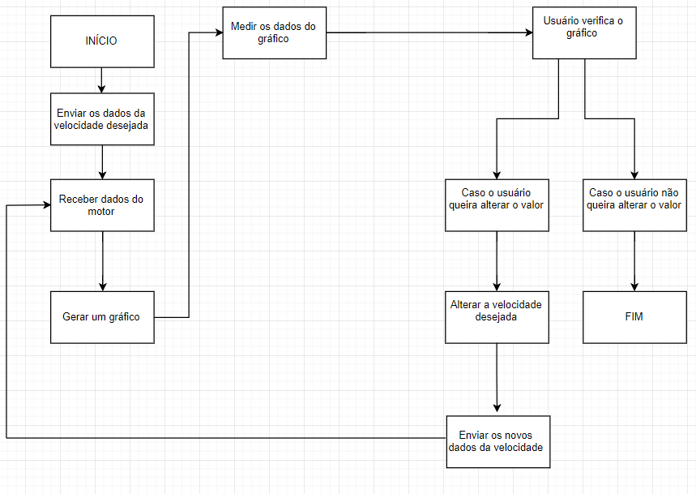
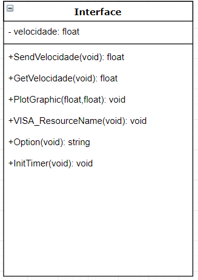

Descrição: Fazer um programa no PC para controlar e testar a velocidade do motor.

Motivação: Melhorar a movimentação dos robôs do projeto de futebol de robôs Very Small Size (VSS), através do controle da velocidade.   

Função: O programa irá receber os dados de velocidade do motor, através da interface USB. Esses valores podem ser alterados e testados até que se obtenha a velocidade ideal desejada.

Tutorial: foi feito um tutorial sobre como usar a interface gráfica do LabVIEW, através da geração de um gráfico da temperatura em um termômetro, conforme consta o site: https://www.youtube.com/watch?v=StLS3-4zNtY&index=6&list=PL3eTiRgIgSyg05FeTbfWisw_TESZ6Axk1

O resultado foi o seguinte gráfico:

Fluxograma:

Diagrama de Classes:

Esboço da interface: usando a interface gráfica do LabVIEW, foi criado um esboço de como ficará o projeto:

Para entender melhor o esboço será usada a seguintes imagens: 

  

Em A, o programa será iniciado ao escolher a porta serial

Em B, será enviado a velocidade da roda do motor

Em C, será recebida e medida a velocidade da roda do motor

Em D, será gerado o gráfico da velocidade pelo tempo

Em E, o usuário irá alterar os valores da velocidade desejada. Com a alteração, o programa irá fazer tudo novamente.
Caso contrário, ele pode finalizar o programa (em F).

Projeto:

O programa recebe dados do usuario e responde, conforme o que ele pede.

Os dados do usuário são enviados em forma de comandos, que indicam o que o programa deve fazer, conforme a figura a seguir:

Na linha 12, foi definido uma classe cmd_info que funciona recebendo o comando através de argumentos. Para o progrma funcionar, o usuário irá enviar 3 argumentos, que envolve o comando velocidade, o valor da velocidade e qual a roda.

Com os dados enviados, a interface gráfica recebe os dados, conforme o diagrama de classe, através da GetVelocidade(void). Com o InitTimer e dado da velocidade, é traçado o gráfico (PlotGraphic).

Para enviar os dados para a roda, o usuário seleciona a roda em Options (enviando E ou D), envia a velocidade em SendVelocidade e seleciona a porta serial em VISA_ResourceName. Para finalizar o programa, basta apertar End. Recomenda-se colocar a velocidade no zero antes de parar o programa

Por fim ele terá acesso a seguinte interface gráfica, em que o gráfico é feito em PlotGraphic:

Nela o usuario observa a velocidade da roda direita no gráfico. Escolhe os valores na região onde tem write, podendo escolher a velocidade da roda direita, esquerda ou ambas.

Para melhor visualização do programa em funcionamento foi feito um vídeo ilustrativo na pasta vídeos.

