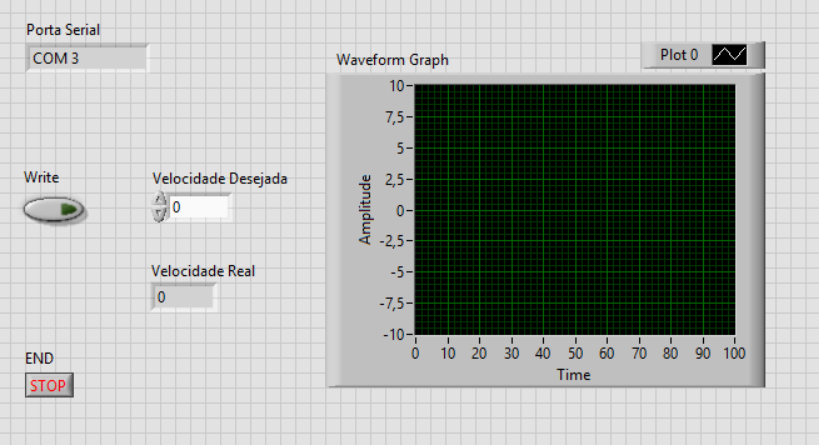
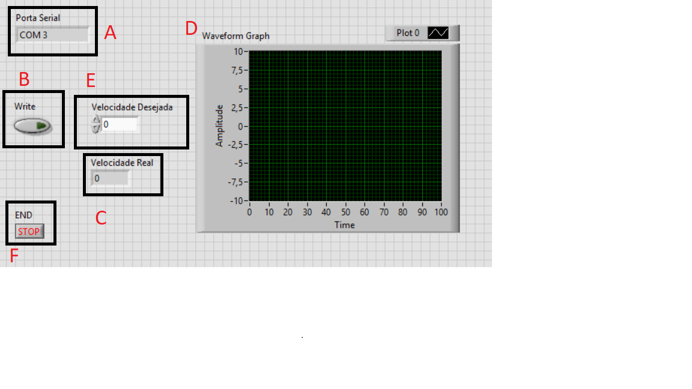

Fazer um programa no PC para controlar e testar os parâmetros do controle.

Motivação: Melhorar a movimentação dos robôs do projeto de futebol de robôs Very Small Size (VSS), através do controle da velocidade.   

Função: O programa irá receber os parâmetros de controle do motor, através da interface USART ou USB. Esses valores podem ser alterados e testados até que se obtenha a velocidade ideal desejada.

Tutorial: foi feito um tutorial sobre como usar a interface gráfica do LabVIEW, através da geração de um gráfico da temperatura em um termômetro, conforme consta o site: https://www.youtube.com/watch?v=StLS3-4zNtY&index=6&list=PL3eTiRgIgSyg05FeTbfWisw_TESZ6Axk1

O resultado foi o seguinte gráfico:

Esboço da interface: usando a interface gráfica do LabVIEW, foi criado um esboço de como ficará o projeto:

Para entender melhor o esboço será usada a seguintes imagens: 

  

Em A, observa-se onde o programa irá parar ou começar.

Em B, será recebido a velocidade da roda do motor

Em C, será gerado o gráfico da velocidade pelo tempo

Em D, o usuário irá alterar os valores do parâmetro. Com a alteração, o programa irá fazer tudo novamente.

Programa:

O programa recebe dados do usuario e responde, conforme o que ele pede.

Ele pode pedir a velocidade ou enviar o valor para o robô, conforme video enviado na pasta de videos.

Por fim ele terá acesso a seguinte interface gráfica:

Nela o usuario observa a velocidade das rodas no gráfico. E escolhe os valores na região onde tem write, podendo escolher a velocidade da roda direita, esquerda ou ambas.

